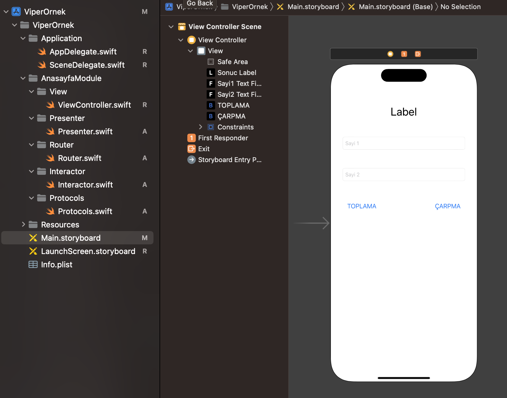

### View
```swift
//  ViewController.swift
import UIKit

class ViewController: UIViewController {

    @IBOutlet weak var sonucLabel: UILabel!
    @IBOutlet weak var sayi1TextField: UITextField!
    @IBOutlet weak var sayi2TextField: UITextField!
    
    var presenterObject: ViewToPresenterProtocol?
    
    override func viewDidLoad() {
        super.viewDidLoad()
        sonucLabel.text = "0"
        Router.createModule(ref: self)
    }

    @IBAction func toplaAction(_ sender: Any) {
        if let str1 = sayi1TextField.text, let str2 = sayi2TextField.text {
            presenterObject?.sumNumbers(str1: str1, str2: str2)
        }
    }
    
    @IBAction func carpmaAction(_ sender: Any) {
        if let str1 = sayi1TextField.text, let str2 = sayi2TextField.text {
            presenterObject?.multiplyNumbers(str1: str1, str2: str2)
        }
    }
}

extension ViewController:PresenterToViewProtocol {
    func viewaVeriGonder(result: String) {
        sonucLabel.text = result
    }
}
```
### Presenter
```swift
//  Presenter.swift
import Foundation

class Presenter: ViewToPresenterProtocol {
    
    var view: PresenterToViewProtocol?
    var interactor: PresenterToInteractorProtocol?
    
    func sumNumbers(str1: String, str2: String) {
        interactor?.sum(str1: str1, str2: str2)
    }
    
    func multiplyNumbers(str1: String, str2: String) {
        interactor?.multiply(str1: str1, str2: str2)
    }
}

extension Presenter: InteractorToPresenterProtocol {
    func presenteraVeriGonder(result: String) {
        view?.viewaVeriGonder(result: result)
    }
}
```
### Router
```swift
//  Router.swift
import Foundation

class Router:PresenterToRouterProtocol {
    static func createModule(ref: ViewController) {
        let presenter = Presenter()
        
        // View layer variables
        ref.presenterObject = presenter
        
        // Presenter layer variables
        ref.presenterObject?.interactor = Interactor()
        ref.presenterObject?.view = ref
        
        // Interactor layer variables
        ref.presenterObject?.interactor?.presenter = presenter
    }
}
```

### Interactor
```swift
//  Interactor.swift
import Foundation

class Interactor: PresenterToInteractorProtocol {
    var presenter:InteractorToPresenterProtocol?
    
    func sum(str1: String, str2: String) {
        if let num1 = Int(str1), let num2 = Int(str2) {
            let result = num1 + num2
            presenter?.presenteraVeriGonder(result: String(result))
        }
    }
    
    func multiply(str1: String, str2: String) {
        if let num1 = Int(str1), let num2 = Int(str2) {
            let result = num1 * num2
            presenter?.presenteraVeriGonder(result: String(result))
        }
    }
}
```
### Protocols
```swift
//  Protocols.swift
import Foundation

// MARK: Main Protocols
protocol ViewToPresenterProtocol {
    var interactor:PresenterToInteractorProtocol? {get set}
    var view:PresenterToViewProtocol? {get set}
    
    func sumNumbers(str1:String, str2:String)
    func multiplyNumbers(str1:String, str2:String)
}

protocol PresenterToInteractorProtocol {
    var presenter:InteractorToPresenterProtocol? {get set}
    
    func sum(str1:String, str2:String)
    func multiply(str1:String, str2:String)
}


// MARK: Carrier Protocols
protocol InteractorToPresenterProtocol {
    func presenteraVeriGonder(result:String)
}

protocol PresenterToViewProtocol {
    func viewaVeriGonder(result:String)
}

protocol PresenterToRouterProtocol {
    static func createModule(ref: ViewController)
}
```

##
###

